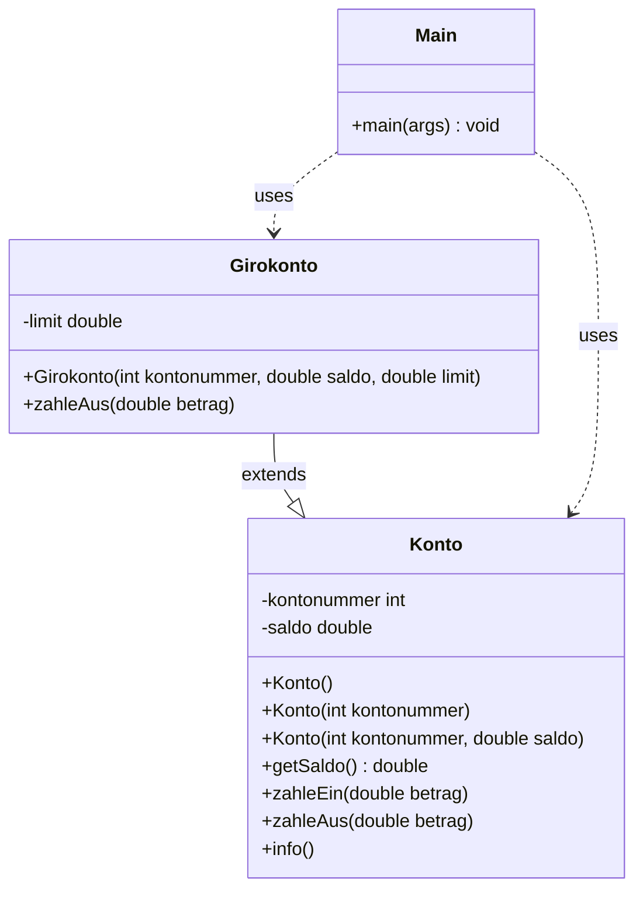

### Klassendiagramm

```mermaid
classDiagram
    class Main{
        +main(args) void
    }
  
  class Konto{
      -kontonummer int
      -saldo double
      +Konto()
      +Konto(int kontonummer)
      +Konto(int kontonummer, double saldo)
      +getSaldo() double
      +zahleEin(double betrag)
      +zahleAus(double betrag)
      +info()
  }
  
  class Girokonto{
      -limit double
      +Girokonto(int kontonummer, double saldo, double limit)
      +zahleAus(double betrag)
  }
  Girokonto --|> Konto: extends
  Main ..> Konto: uses
  Main ..> Girokonto: uses


```
