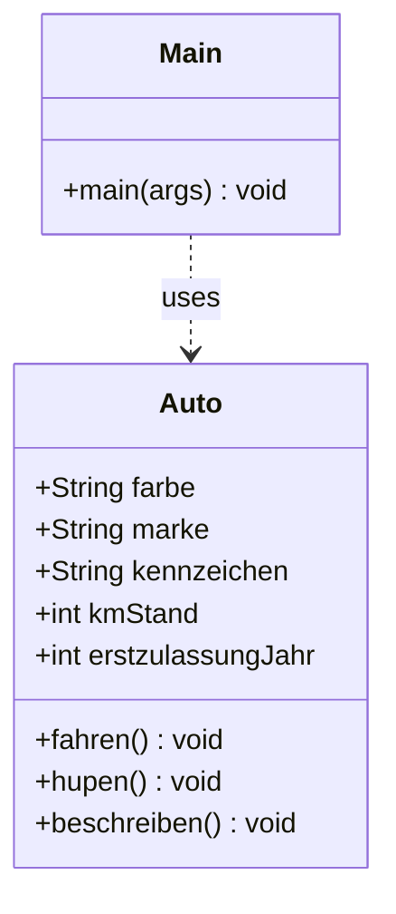

# Objektorientierte Programmierung in JAVA

## Version 1 des Programms
In diesem Verzeichnis finden Sie ein einfaches Java Programm bestehend aus zwei Klassen; die Klasse `Main` mit der
Logik zur Programmausführung und die Klasse `Auto`, welche ein Fahrzeug mit gängigen Attributen und Methoden beschreibt.

### Klassendiagramm

