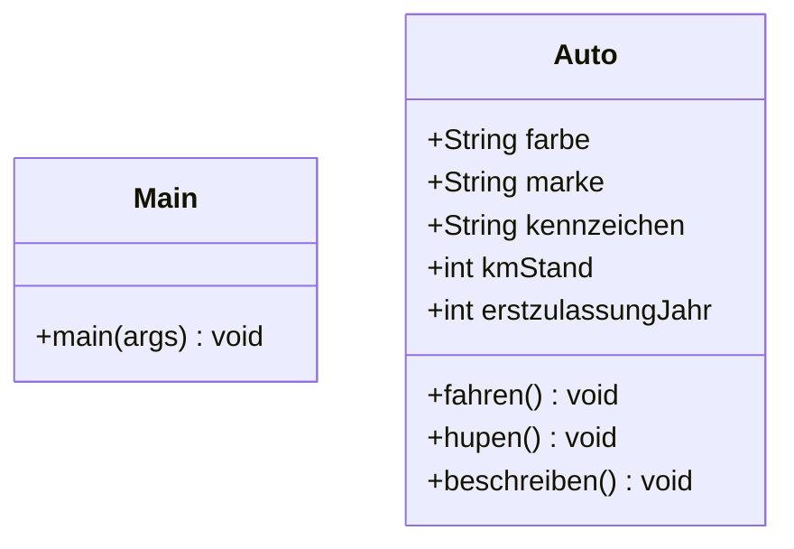

# Objektorientierte Programmierung in JAVA

## Version 1 des Programms
In diesem Verzeichnis finden Sie ein einfaches Java Programm bestehend aus zwei Klassen; die Klasse `Main` mit der
Logik zur Programmausführung und die Klasse `Auto`, welche ein Fahrzeug mit gängigen Attributen und Methoden beschreibt.

### Klassendiagramm



### Kompilierung & Ausführung
Wechseln Sie zunächst in das Programmverzeichnis `/oop-version1/src/`, um das Programm mit Java zu kompilieren und
im Anschluss auszuführen. Sollten Sie eine IDE, z.B. IntelliJ, nutzen, können Sie direkt in der Klasse Main das
Programm starten.

```
// Alle Java Dateien in diesem Verzeichnis werden kompiliert
javac *.java 

// Die kompilierte Java Klasse Main wird ausführen
java Main
```