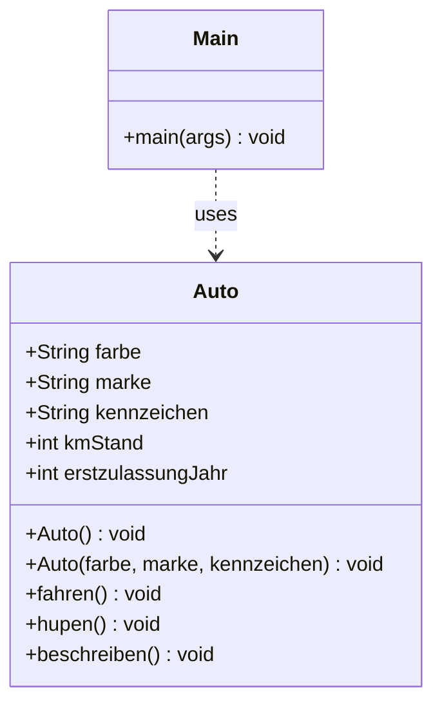

# Objektorientierte Programmierung in JAVA

## Version 2 des Programms
Die Klasse [Auto](src/Auto.java) wurde um Konstruktor Methoden erweitert, um Erstellung von Objekten der Klasse mit 
initialen Attributwerten einfacher zu ermöglichen. 

Es wurden zwei Konstruktor Methoden ergänzt:

* `Auto()` damit kann auch zukünftig ein Objekt von der Klasse erzeugt werden ohne Parameter
* `Auto(farbe, marke, kennzeichen)` ermöglicht Erstellung eines Objektes mit ein paar initialen Attributwerten

### Klassendiagramm

