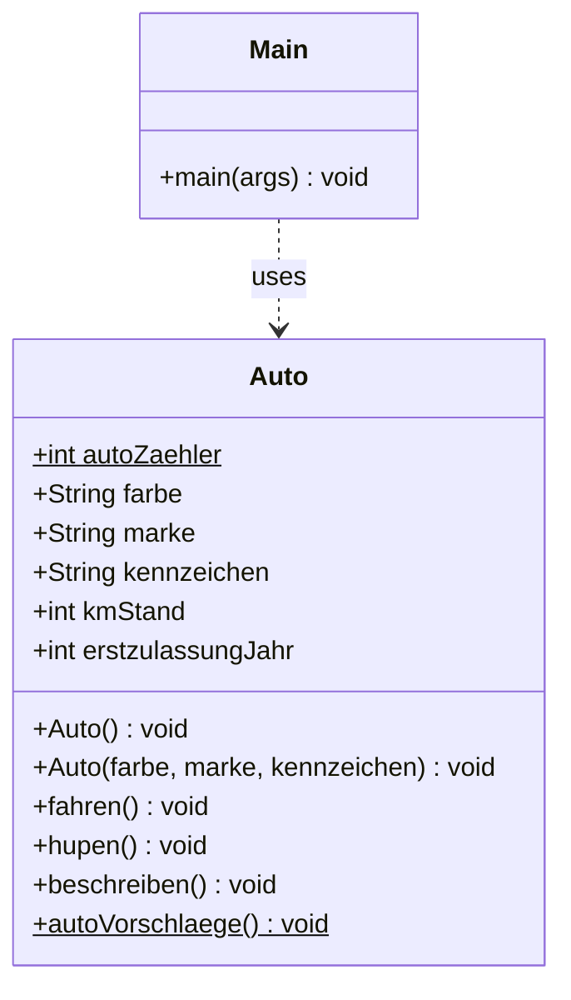

# Objektorientierte Programmierung in JAVA

## Version 3 des Programms
Die Klasse [Auto](src/Auto.java) wurde um Klassenvariablen und Klassenmethoden erweitert.  
Diese besondere Form einer Variable bzw. Methode hat eine gemeinsame Gültigkeit für alle Instanzen der Klasse. 
Sie wird also nicht für die einzelnen Instanzen jeweils neu angelegt, sondern nur einaml für die Klasse selbst.
Sie erkennen diese anhand des `static` Schlüsselwortes im Quellcode.

* `autoZaehler` eine **Klassenvariable**, die Anzahl aller erzeugten Autos zählt.
* `autoVorschlaege()` eine **Klassenmethode**, die unabhängig von einer konkreten Instanz einen Text
  und Anzahl der erzeugten Autos ausgibt.

*Übrigens: Sie erkennen Klassenvariablen und Klassenmethoden im UML Diagramm an der Unterstreichung.*

### Klassendiagramm

