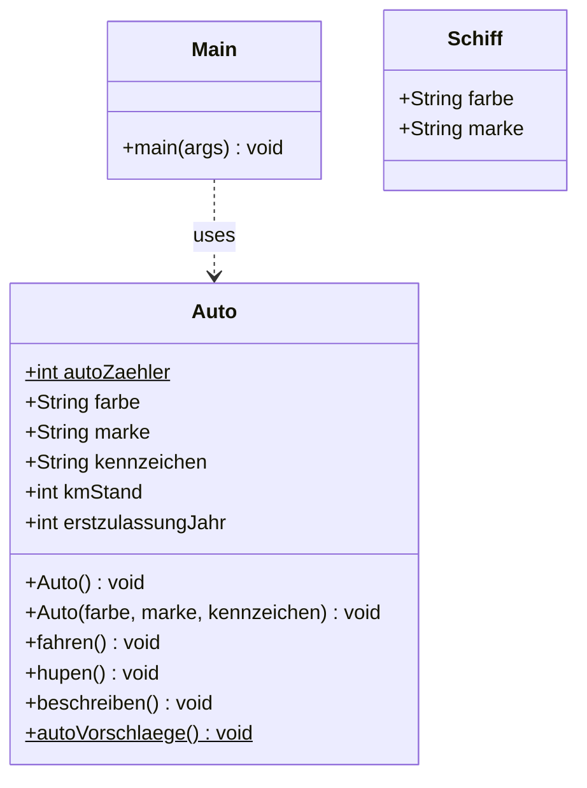

# Objektorientierte Programmierung in JAVA

## Version 4 des Programms
Es wurden Packete im Java Programm ergänzt für eine bessere Strukturierung. Als Packetname für das Programm wurde
exemplarisch `de.rhkoeln.app` gewählt. Die Klasse `Auto` ist im Unterpaket `fahrzeuge` abgelegt.
Zusätzlich wurde rudimentär die Klasse `Schiff` angelegt.

### Klassendiagramm

